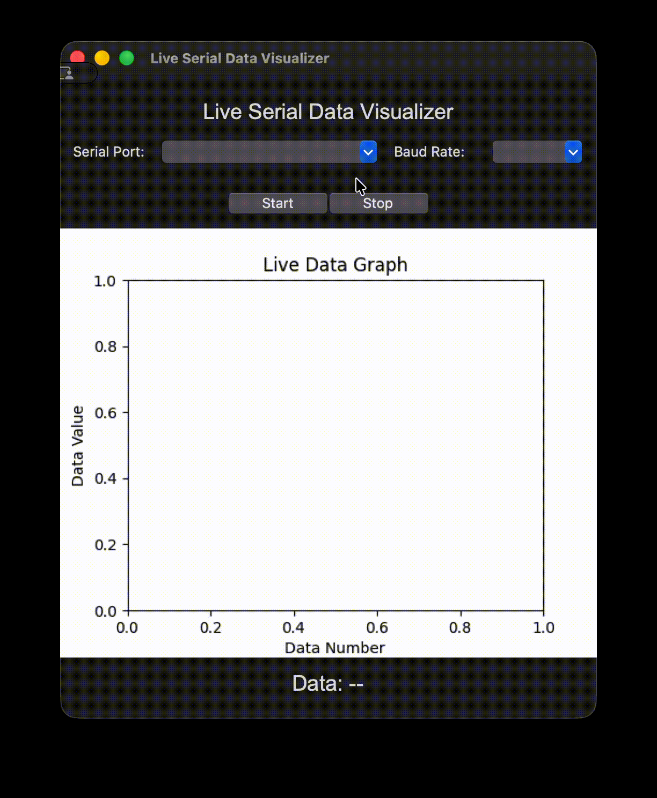

# Live Serial Data Visualizer

This project is a **Python desktop application with a simple graphical interface (Tkinter)** that allows users to visualize **real-time serial data** on a live-updating graph.
It is designed for use with sensors, microcontrollers (e.g., Arduino, ESP32), or any other device that communicates via a serial port.

---

## 🖼️ Demo



---

## 🔍 Features

* **Real-time data plotting:** Continuously visualizes incoming serial data on a live graph.
* **Interactive interface:** Built with `Tkinter` for selecting port and baud rate easily.
* **Start / Stop control:** Begin or pause data streaming at any time.
* **Live numeric display:** Shows the latest received data value below the graph.
* **Cross-device compatible:** Works with any serial-output system — Arduino boards, sensor modules, lab instruments, etc.

---

## ⚙️ Requirements

Install the following dependencies before running:

```bash
pip install pyserial matplotlib
```

---

## 🧩 Usage

1. Connect your serial data source to your computer.
   *(For example: an Arduino board sending numeric data via `Serial.println()`.)*

2. Run the program:

   ```bash
   python live_plot.py
   ```

3. In the window:

   * Select the **serial port** (e.g., `COM3` or `/dev/tty.usbmodem101`)
   * Choose a **baud rate** (e.g., `9600`)
   * Click **Start** to begin reading and visualizing data
   * Click **Stop** to safely close the connection

4. The latest received value will appear above the graph in real-time.

---

## 🖼️ How It Works

1. The GUI (Tkinter) lists available serial ports and baud rates.
2. When “Start” is pressed, a background thread continuously reads data from the selected port.
3. Each new numeric value is plotted live using `matplotlib` embedded within the interface.
4. The user can stop data collection at any time — the port closes automatically.

---

## 🧠 Use Cases

* Monitoring real-time sensor outputs (temperature, humidity, pressure, etc.)
* Testing Arduino or ESP32 serial outputs visually
* Debugging live data streams from experimental or industrial setups
* Educational demonstrations of data acquisition systems

---

## 🧰 Notes

* Port names differ by operating system:

  * **Windows:** `COM3`, `COM4`, etc.
  * **macOS / Linux:** `/dev/tty.usbmodem101`, `/dev/ttyACM0`, etc.
* Incoming data must be **numeric** (e.g., `"23.7"`).
* The application automatically handles serial closure when stopped or exited.
* Errors (like invalid ports or decoding issues) are displayed on-screen instead of the console.

---

💡 *Built with Python, Tkinter, Matplotlib, and PySerial.*
